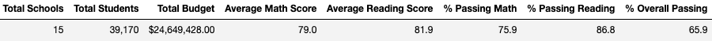
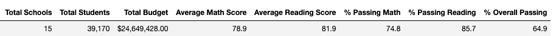
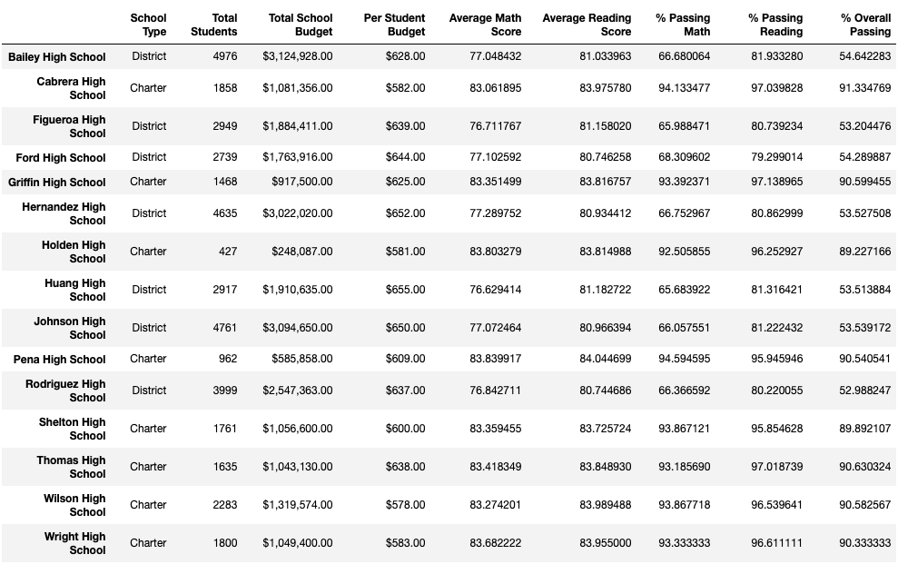
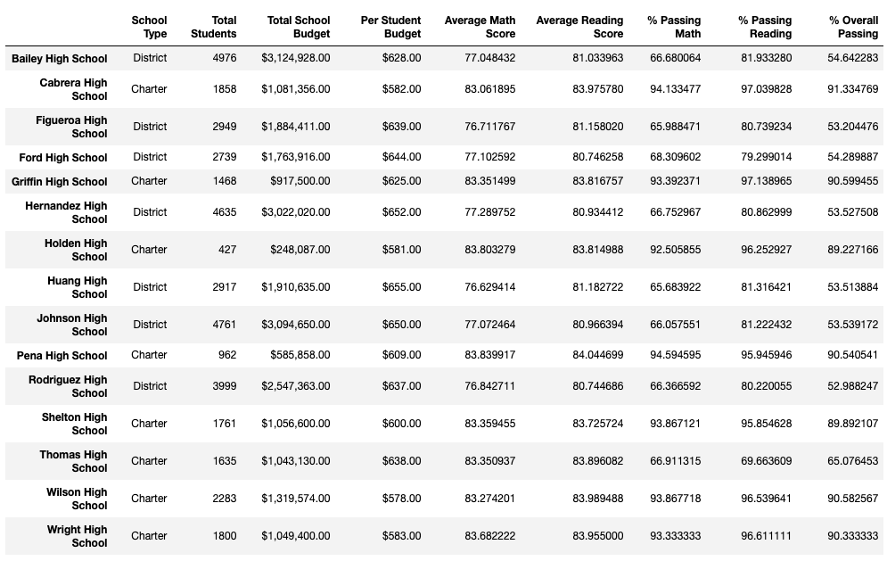

# Module_3_Challenge
# Overview of School District Analysis
In this analysis we want to look at how the testing scores vary between grade, school type, student size, and most importantly funding. Below we are going to look at a variety of different groupings to give us more insight into how the schools are doing and what may be causing those results. In this case we are taking out scores from 9th graders from Thomas High School for potential academic dishonesty.
# Results
Below we have the two results for the District Summary. The first one without taking out the 9th grade scores from Thomas High School due to academic dishonesty and the second chart shows the results with those scores taken out. The district summary is slightly affected since it's a small sample for the whole district . We did not adjust the total students in this summary so the passing rates across the board are about 1% lower cause it consideres the "NaN" as not passing.

In the School Summary the only school that was affected was Thomas High School since that's where all the scores were replaced. The average scores of math and reading stayed about the same, but yet again this summary views the "NaN'' as not passing so the Passing %'s across the board have decreased about 30%. This takes Thomas High School from an overall passing % from 2nd best to 8th in the district

- Math and reading scores by grade is barely affected, not visible unless we increase the decimals
- Scores by school spending is barely affected, not visible unless we increase the decimals
- Scores by school size is barely affected, not visible unless we increase the decimals
- Scores by school type is barely affected, not visible unless we increase the decimals
# Summary
## 4 Changes in the Analysis 
  - Reading, Math,and Overall passing % that included 9th grade data from Thomas High School with "NaN"'s decreased dramatically since "NaN" was being counted as a fail.
  - Reading, Math,and Overall average grades that included 9th grade data from Thomas High School with "NaN"'s stayed around their average. "NaN" was not counted
  - Thomas High School was incorrectly put into the wrong bin for spending due to the 9th grade getting taken out of their total student count, but their budget stayed the same.
  - Thomas High School was incorrectly put into the wrong bin for school size due to the to the 9th grade getting taken out of their total student count
